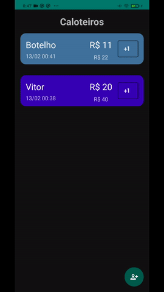
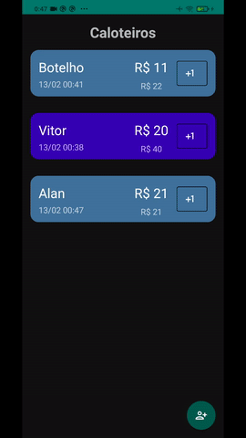
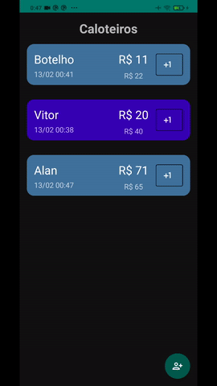
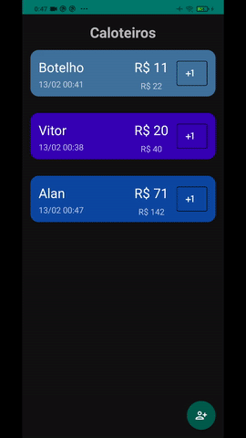

# Controle de débitos
App android para o um dos projetos do bootcamp da DIO

Usando a tecnologia Room para gerenciar e fazer a persistência dos dados, além de vários conceitos aprendidos no projeto "Criando um App de Cartão de Visitas em Kotlin"
para o bootcamp "Sportheca Mobile Developer"

## Adicionar (toque no float button)

## Editar usando um simples diálogo (toque no "+1")

## Tela de edição com menu dropdown personalizado (toque longo)

O dropdown deu bastante trabalho, usei um ArrayAdapter customizado

## Detalhar e compartilhar (toque simples)

